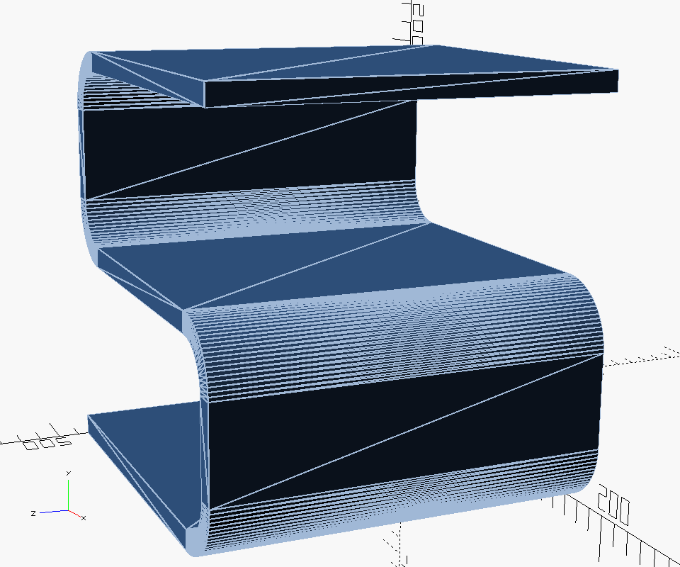

S-stand OpenSCAD module
=======================

A reusable [OpenSCAD] module for creating stands in a flattened "S"-shape.

It was primarily designed as speaker/audio monitor stand (more specifically as
stand for the [M-audio AV 40]) but can be easily adjusted in size to suit your
needs.

The stand is oriented so it can be easily 3D printed. For the intended usage
orientation rotate 90° on the X-axis.

Example usage
-------------

```
use <s-speakerstand.scad>

$fa=1; // Increase resolution of rounded parts
s_stand(185, 165, 200, 30, 10);

```

Which gives you a stand with a width of 185, depth of 165, height of 200, round
corners with radius 30 and wall thickness of 10 which looks like:



Note: The depth is the depth of the top and bottom flat shape. The total depth
is depth + radius.

Advanced usage
--------------

This library also exports the `s_stand_shape` module that can be used to make
custom extrusions of the shape.

[OpenSCAD]: http://www.openscad.org/
[M-audio AV 40]: http://www.m-audio.com/products/view/studiophile-av-40
